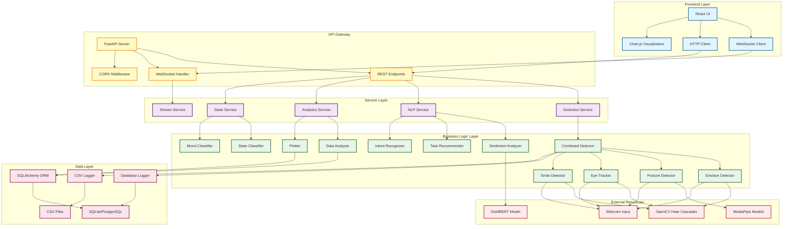
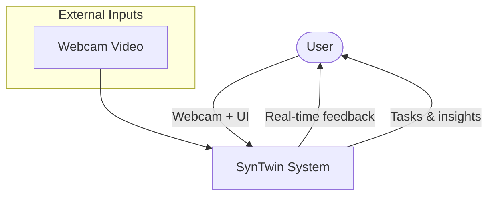
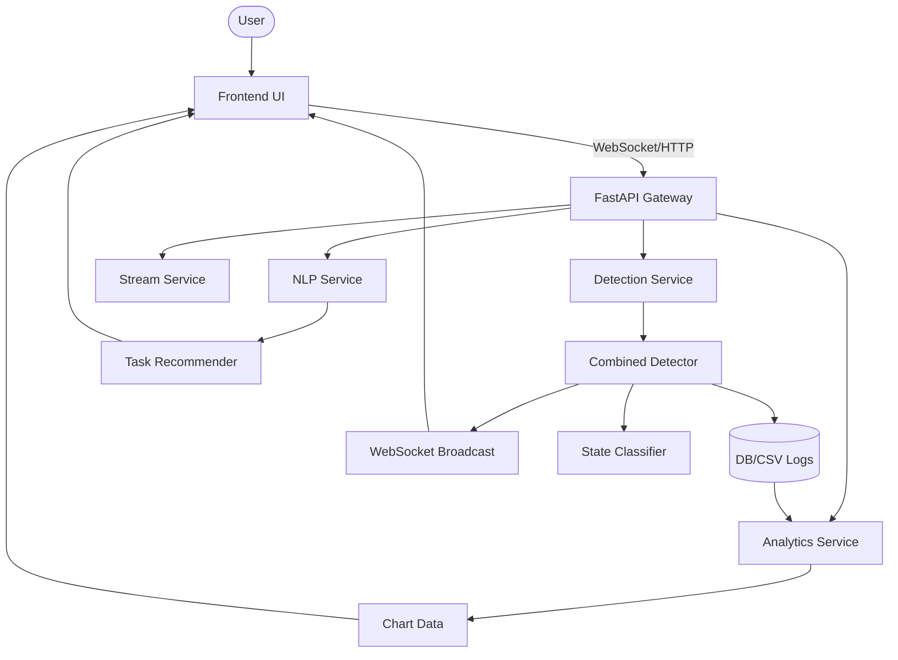
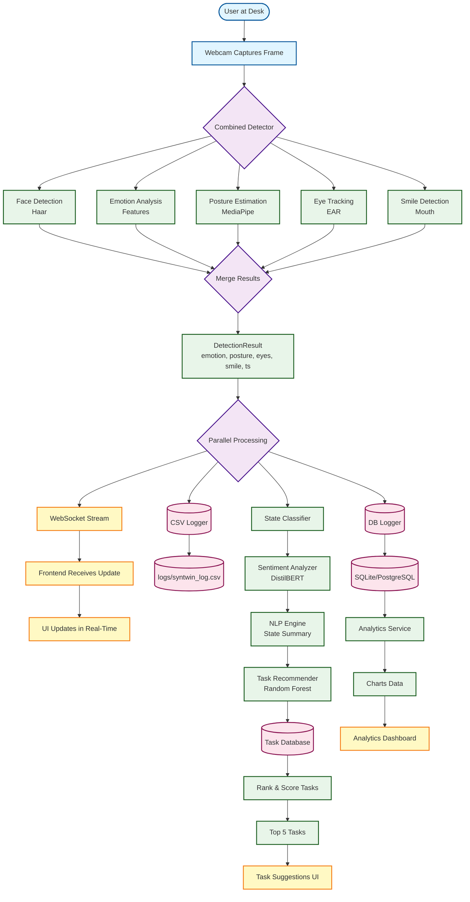
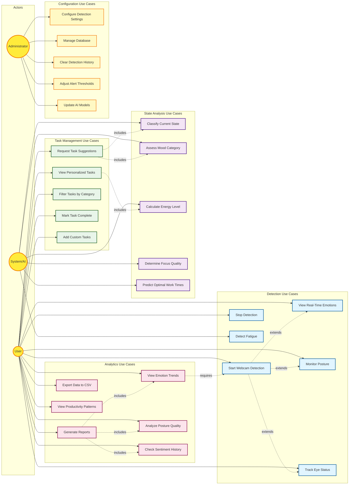
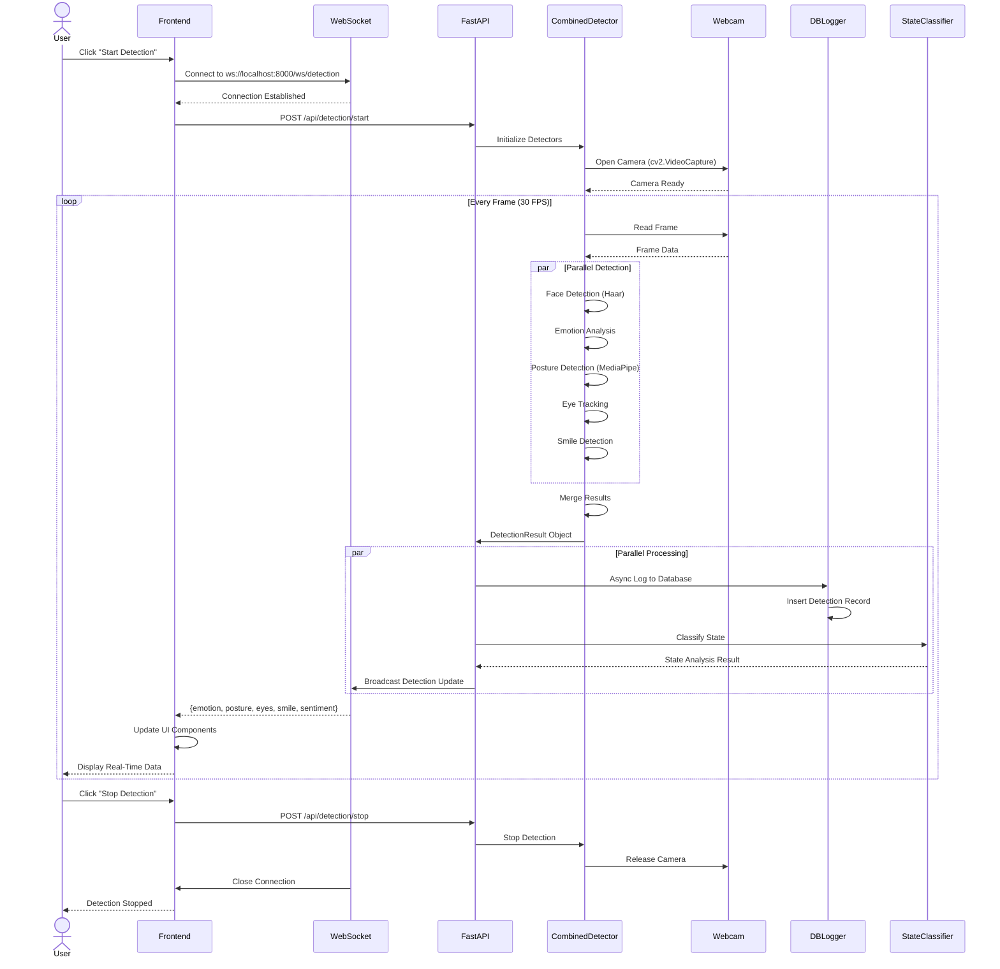
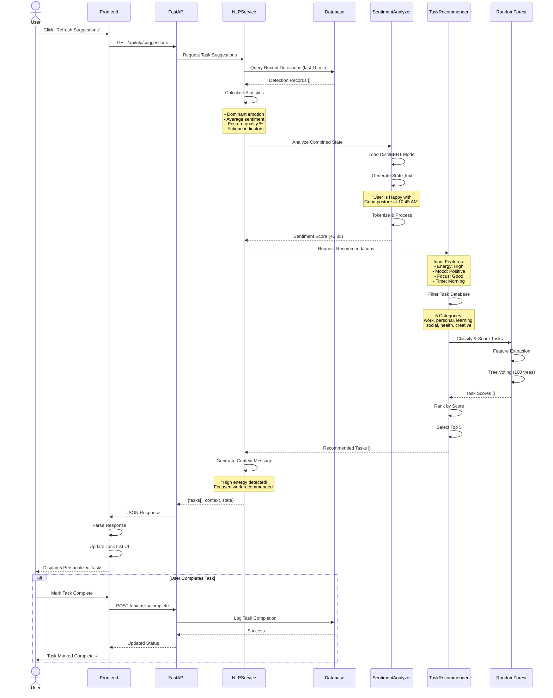
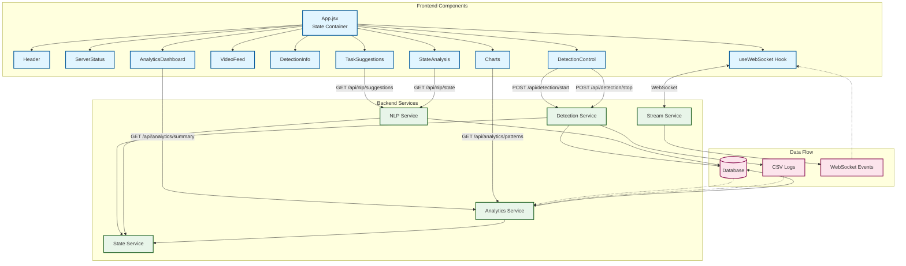
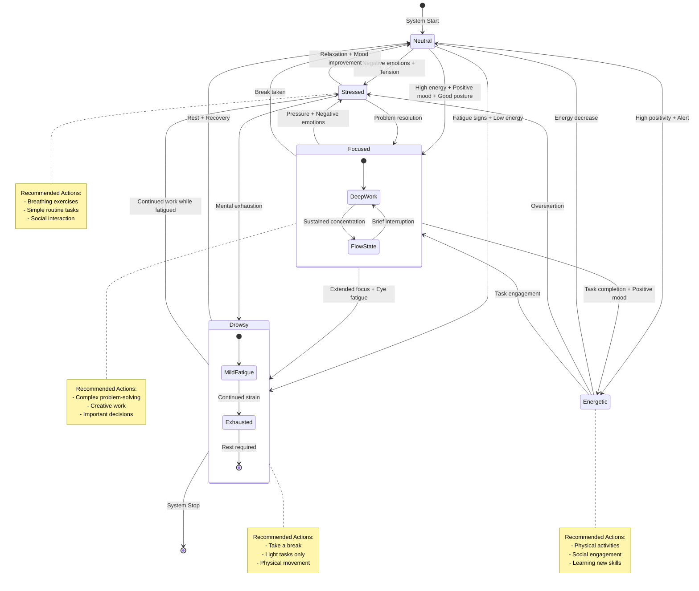
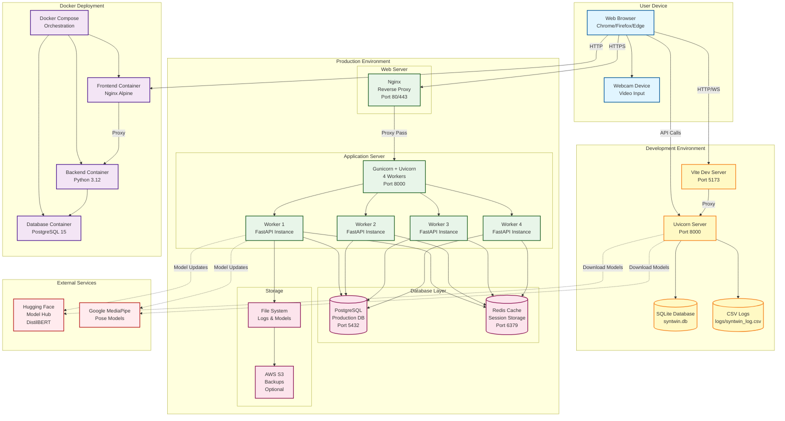

# 📐 System Diagrams for SynTwin Project

This document contains comprehensive system diagrams using Mermaid syntax for the SynTwin project.

## System Architecture Diagram

## Data Flow Diagrams (Leveled)

### Level 0 – Context

### Level 1 – Major Subsystems

### Level 2 – Detailed Flow (Final)

## Use Case Diagram

## Sequence Diagram - Real-Time Detection Flow

## Sequence Diagram - Task Recommendation Flow

## Component Interaction Diagram

## State Machine Diagram - User State Transitions

## Deployment Diagram

---

## 📊 Diagram Legend

### Color Coding

- **Blue** 🔵: Frontend components and user-facing elements
- **Green** 🟢: Backend services and business logic
- **Pink** 🔴: Data storage and persistence layer
- **Yellow** 🟡: API and communication layers
- **Purple** 🟣: Decision points and state management
- **Red** 🔴: External services and dependencies

### Diagram Types Explained

1. **System Architecture Diagram**: Shows the overall structure and how major components interact across all layers
2. **Data Flow Diagram**: Illustrates the complete journey of data from webcam capture to UI display
3. **Use Case Diagram**: Depicts all possible user, system, and admin interactions with the application
4. **Sequence Diagrams**: Detail the step-by-step chronological flow of two critical operations:
   - Real-time detection and WebSocket streaming
   - AI-powered task recommendation generation
5. **Component Interaction Diagram**: Shows the relationships and data flow between frontend React components and backend services
6. **State Machine Diagram**: Represents possible user state transitions based on detected emotions, posture, and fatigue
7. **Deployment Diagram**: Visualizes the complete deployment architecture for development, production, and Docker environments

### How to Use These Diagrams

- **For Development**: Use architecture and component diagrams to understand code organization
- **For Documentation**: Include relevant diagrams in technical specifications
- **For Presentations**: Use data flow and use case diagrams to explain functionality
- **For Onboarding**: Help new developers understand system design with sequence diagrams
- **For DevOps**: Reference deployment diagram for infrastructure setup

---

**Note**: These diagrams are created using Mermaid syntax and will render beautifully in:
- GitHub README files
- GitLab markdown
- VS Code with Mermaid extension
- Documentation sites (MkDocs, Docusaurus, etc.)
- Notion, Confluence, and other modern documentation platforms
